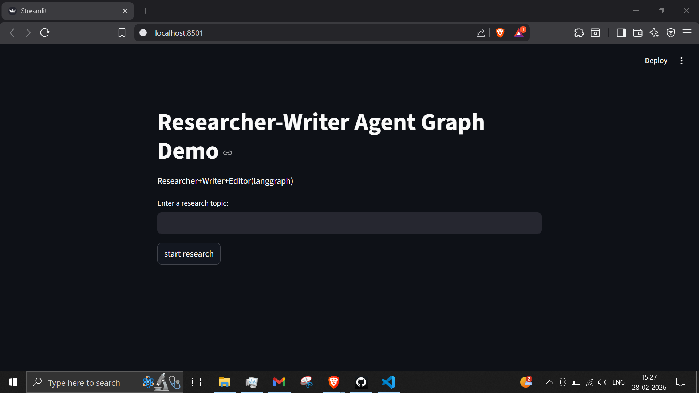
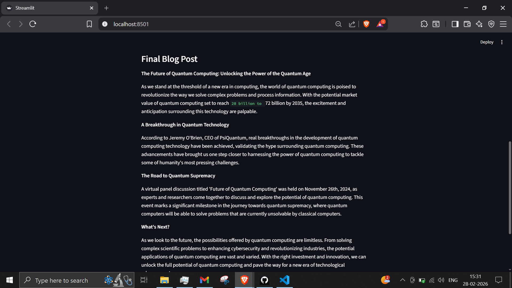

# 🤖 Autonomous Research Team (LangGraph + Llama 3)

An intelligent multi-agent system that collaborates to research topics and write high-quality blog posts. Built using **LangGraph** for cyclic orchestration, **Groq** for high-speed inference, and **Streamlit** for the frontend.

## 🧠 The Architecture

Unlike linear chains, this project uses a **State Graph**. The agents share a memory state and can loop back to correct errors or refine content.

```
graph TD;
    START --> Researcher;
    Researcher -- Finds Facts --> Writer;
    Writer -- Drafts Content --> QualityCheck;
    QualityCheck -- "Approved" --> END;
    QualityCheck -- "Reject/Retry" --> Writer;
```

*   **Researcher Agent:** Uses `DuckDuckGo` to perform real-time web searches and summarizes key facts.
*   **Writer Agent:** Takes the research data and crafts an engaging blog post using `Llama-3.1`.
*   **Quality Control:** (Conditional Logic) A programmatic check that evaluates the output and decides whether to publish or loop back for a rewrite.

## 🚀 Features

*   **Real-Time Web Access:** Not limited to training data; fetches live information.
*   **Multi-Agent Collaboration:** Separation of concerns between researching and writing.
*   **Cyclic Self-Correction:** The system can reject poor outputs and retry automatically.
*   **Interactive UI:** Built with Streamlit to visualize the thought process of every agent.

## 🛠️ Tech Stack

*   **Orchestration:** LangGraph, LangChain
*   **LLM:** Llama-3.1-70b (via Groq API)
*   **Tools:** DuckDuckGo Search
*   **Frontend:** Streamlit
*   **Language:** Python 3.10+

## 📦 Installation & Setup

1.  **Clone the repository**
    ```
    git clone https://github.com/vaishnavak2001/Multi-Agent-Researcher.git
    cd Multi-Agent-Researcher
    ```

2.  **Create a Virtual Environment**
    ```
    python -m venv venv
    # Windows:
    .\venv\Scripts\activate
    # Mac/Linux:
    source venv/bin/activate
    ```

3.  **Install Dependencies**
    ```
    pip install -r requirements.txt
    ```

4.  **Configure Environment Variables**
    Create a `.env` file in the root directory and add your Groq API key:
    ```
    GROQ_API_KEY=gsk_your_api_key_here
    ```

## 🏃‍♂️ Usage

Run the Streamlit application:

```
streamlit run app.py
```

1.  Enter a research topic (e.g., "The Future of Quantum Computing").
2.  Watch the **Researcher** gather data in real-time.
3.  View the **Writer** synthesize the draft.
4.  See the final result in the UI.





## 🔮 Future Improvements

*   **Human-in-the-loop:** Add a "Review" node where a human must approve the draft before it finishes.
*   **Format Selection:** Allow users to choose between a "Tweet Thread", "LinkedIn Post", or "Full Article."
*   **Source Citing:** Force the Writer to include hyperlinks to the sources found by the Researcher.


